# Brunel Sports – A timetabling app for Brunel sports clubs

This was a 6-month group project, to develop a data driven application that isn’t already created and has non-trivial functionality.
I wrote up a diary/report of all my work for this project. This is a short summary of the report as it is very extensive, the [report can be viewed on GitHub](#Report).


## Table of Contents

* [App Concept](#App-Concept)
* [Research](#Research)
* [Design](#Design)
* [Logo](#Logo)
* [Development](#Development)
  * [7th January](#7th-January)
  * [3rd February](#3rd-February)
  * [25th February](#25th-February)
  * [7th March](#7th-March)
  * [15th March](#15th-March)
* [Video](#Video)
* [Report](#Report)

## App Concept

As a very active member of many Brunel sports clubs, I found that it can be very difficult to keep up to date with training times. Different clubs use different social media to update their users, from Facebook, Instagram, Twitter or WhatsApp. This can be frustrating as you turn up to training to find people standing around telling you that it has been cancelled. 

This App idea is a unified way to update your training times and put it on an easily accessible calendar. This can be used in many ways, for example but not limited to; New members are able to search for clubs during a specific time, which currently isn’t possible. Check when training is on this week. Ask questions to the club president.


## Research

Before starting on the design, research was done on similar timetabling apps. The first app is a very well designed one for our purposes. The app includes a widget that shows your events for that day, this could be considered, the user won’t need to constantly open the app to check their sports.

<p>
  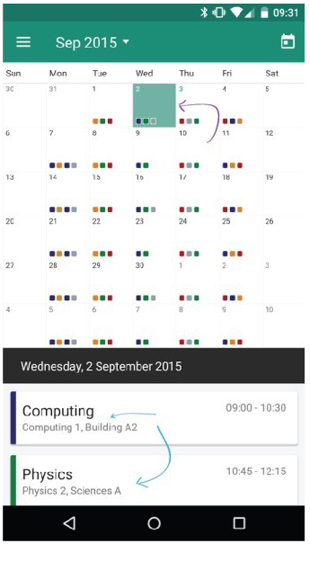
  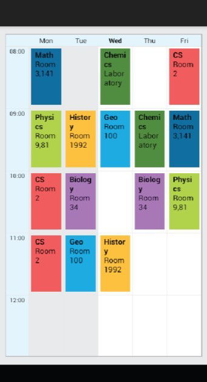
  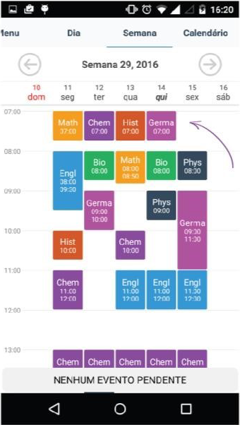
</p>

## Design
Draw.io was used to create the initial designs. Not all the features needed were on the website, therefore, Adobe Photoshop was also used to finish up the designs. The designs go from left to right, left being the homepage, middle being the calendar which I am creating, right the final design for the calendar.
The final design shows only two weeks ahead as users will use the app to check recent upcoming clubs. Added colour coded dots around the days of the week so if the user remembers the colour scheme, they can quickly identify which events are on. The bottom panel showed events on that current selected day or the next event. Changed the colours scheme to match the Brunel University colours. 

<p>
  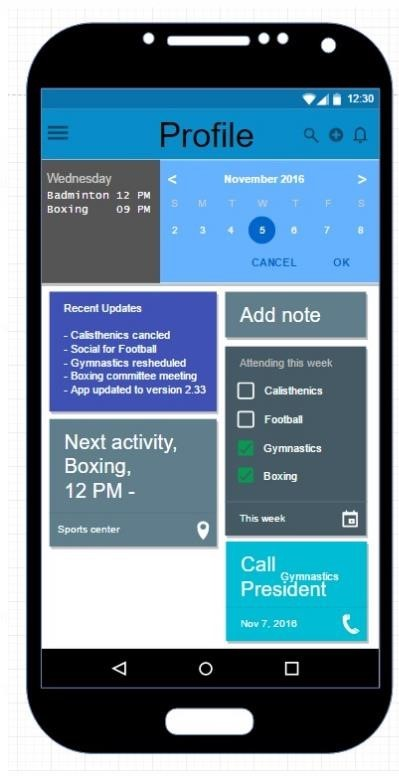
  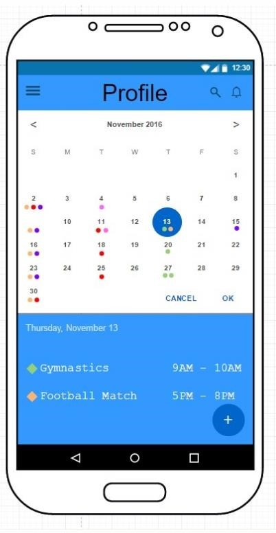
  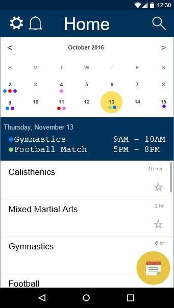
</p>  
   
## Logo
Created a logo for the app that can be used in the Android Store and promotional videos or any other marketing material. The logo uses the rounded squares that is common with mobile apps. The ‘Futura’ font was used as it is the same font used in the Brunel University logo.
  


## Development
 
### 7th January
With no previous experience in Android development, a basic layout was made to reflect the designs in phase 1. The Google calendar was implemented due to it being the most popular. Displaying only two weeks as per the design was done by just reducing the calendars height. However, this is a bad solution due to the rest of the months not being accessible. Another difficulty found was the inability to remove the month from the top of the calendar. A simple string was used under the calendar to display what day was selected.

```java
public void onSelectedDayChange(CalendarView view,int year, int month, int dayOfMonth) {  
   textout = (TextView) findViewById(R.id.textDate);  
   textout.setText(" "+dayOfMonth + "/" + month + "/" + year);  
}  

calendarView .set(Calendar.YEAR, year);  
calendarView .set(Calendar.MONTH, month);  
calendarView .set(Calendar.DAY_OF_MONTH, day);  
``` 

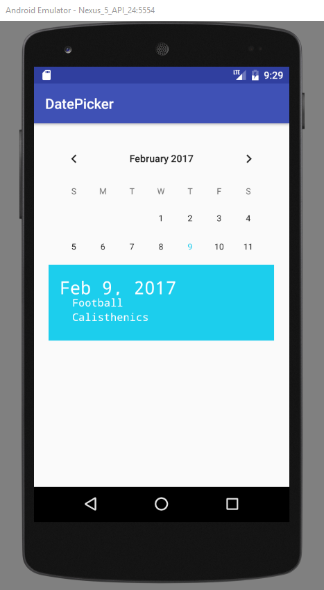

### 3rd February
  
A month later, continuing to have issues with the google calendar, such as not being able to circle the current date or adding events in terms of dots. Another calendar was tested, the calendar was created by SundeepK and was available on GitHub (https://github.com/SundeepK/CompactCalendarView). This calendar was easily modified allowing for circling of dates and adding of events as designed. The events were displayed in a ‘toast’ message at the bottom of the app. The snippet below shows how an event was created, the date of the event used time in milliseconds which would have to be converted.

```java
  [Event{color=6711936, timeInMillis=1488110400000, data=Football Training 12:00}]  
```

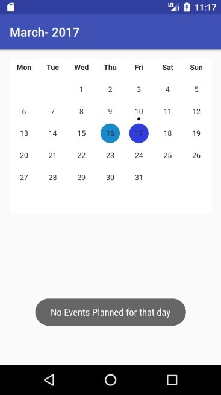 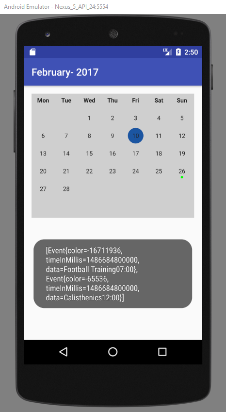

### 25th February

The app started to come together looking similar to the initial concept, however the events were a bunch of if statements. This is never going to work as a plausible app as events would have to be taken from a database and if statements can’t be created for all possibilities. 


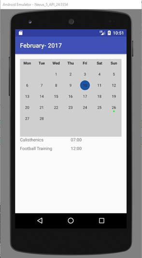 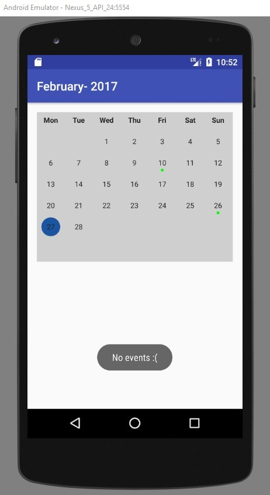
 
### 7th March
 
The events have been fixed. The if statements were replaced with a for loop, that looped through every event in the clicked-on day and the strings and dates were retrieved and displayed. The date under the calendar was created in the same way as the initial development.

```java   
for (Event event : events) {   
   // For loop to loop through every event of the day   
   eventToString = event.getData().toString();   
   // Gets the data (club names) of the event   
   stringBuilder.append(eventToString + "\n");   
   // Builds a string by getting the data and creating a new line
   p = event.getTimeInMillis();   
   // Gets the time of the event
   stringBuilderT.append(formatted + "\n");   
   // Builds it the same way as the event with a line break   
}   
eventTime.setText(stringBuilderT);   
eventText1.setText(stringBuilder);   
// Gets the final String and displays it   
```

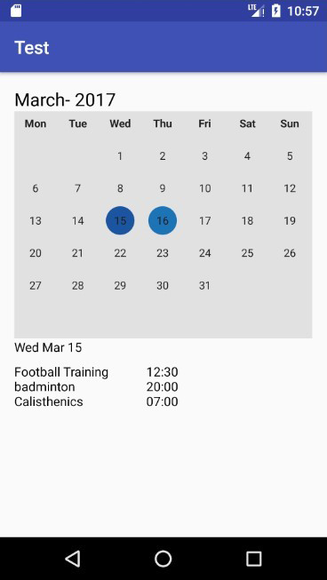

### 15th March

The month now displays above calendar in the centre. Events are now colour coded and display along side the string of the event, will need to add a more obvious graphic. If a date is clicked where there are no events, a while loop was added to display the next day with events.

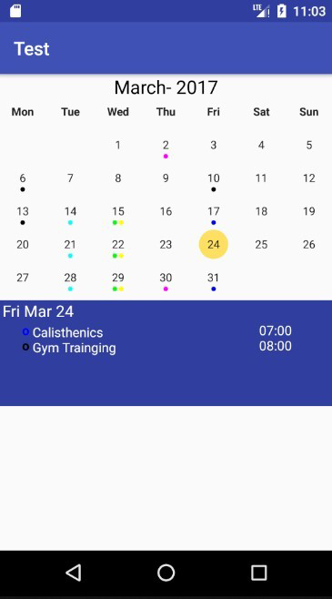 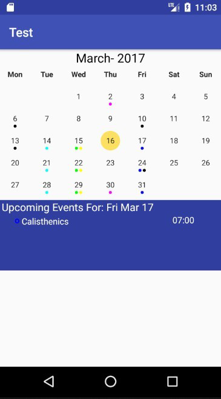


## Video

The below video was created and uploaded to YouTube, Adobe After Effects was used to create it.
https://www.youtube.com/watch?v=nTLULDg7Vm8 

## Report

[Link to report on GitHub](AndroidAppReport.pdf)

